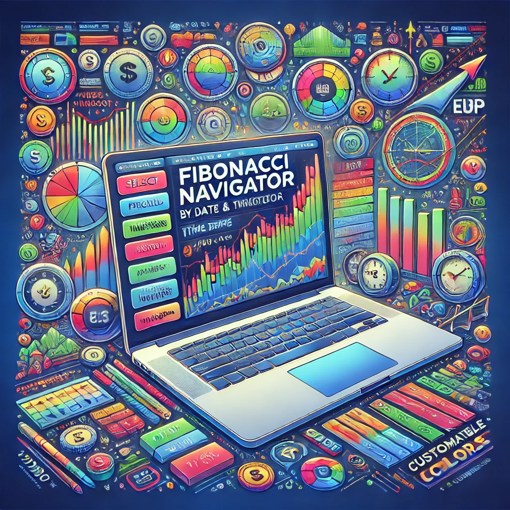

# 📊 Fibonacci Navigator Indicator

Fibonacci Navigator is a powerful Pine Script indicator for TradingView that lets you draw Fibonacci retracement levels on a specific candle based on a given date and timeframe. This tool is perfect for traders looking to analyze price ranges and make informed decisions.

## ✨ Features

- 🔍 **Select a specific candle by date and time**
- ⏳ **Choose from a variety of timeframes including non-standard ones like 2 minutes, 4 minutes, and more**
- 📈 **Automatically draw Fibonacci retracement levels on the selected candle**
- 💡 **Display the price ranges between specified Fibonacci levels**
- 🎨 **Customizable Fibonacci levels and colors**

## 🚀 Usage

1. **Clone or download the repository**:
   ```bash
   git clone https://github.com/saifshabsug/FibonacciNavigator.git
   ```

2. **Copy the Pine Script code** from `fibonacci_navigator.pine` to your TradingView Pine Script editor.

3. **Add the indicator to your chart**.

4. **Configure the indicator settings**:
   - **Candle Date & Time**: Input the specific date and time of the candle you want to analyze.
   - **Timeframe**: Select the desired timeframe from the dropdown options.
   - The Fibonacci levels and colors are predefined in the script.

## 🌟 Example



## 🎨 Fibonacci Levels and Colors

The following Fibonacci levels and their corresponding colors are used in this indicator:

| Level   | Value   | Color   |
|---------|---------|---------|
| Level 0 | 32.236  | 🔵 Blue    |
| Level 1 | 16.236  | 🔵 Blue    |
| Level 2 | 8.236   | 🔵 Blue    |
| Level 3 | 4.236   | 🔵 Blue    |
| Level 4 | 2.618   | 🟢 Green   |
| Level 5 | 1.1414  | 🔴 Red     |
| Level 6 | 1       | ⚪ Gray    |
| Level 7 | 0       | ⚪ Gray    |
| Level 8 | -0.1414 | 🔴 Red     |
| Level 9 | -1.618  | 🟢 Green   |
| Level 10| -3.236  | 🔵 Blue    |
| Level 11| -7.236  | 🔵 Blue    |
| Level 12| -15.236 | 🔵 Blue    |
| Level 13| -31.236 | 🔵 Blue    |

## 🤝 Collaboration

This project is in collaboration with [Hammam Sawalma](https://github.com/hammamsawalma).

## 📜 License

This project is licensed under the MIT License - see the [LICENSE](LICENSE) file for details.
